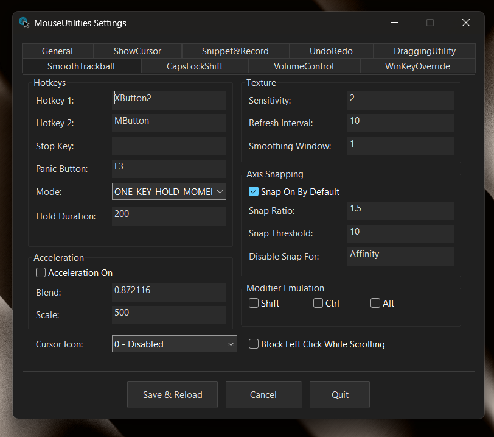

# MouseUtilities

A unified AutoHotkey v2 script combining eight mouse/keyboard utilities into one, with a built-in Settings GUI for easy configuration.



## What It Does

- **ShowCursor** - Find your cursor with PowerToys integration (tap vs hold)
- **SnippetAndRecord** - Take screenshots or record screen (tap vs hold)
- **UndoRedo** - Map mouse buttons to undo/redo for specific apps
- **DraggingUtility** - Context-aware mouse button for PowerToys FancyZones
- **SmoothTrackball** - Smooth scrolling for trackball mice
- **CapsLockShift** - Remap CapsLock to act as Shift key (disabled by default)
- **VolumeControl** - Map custom hotkeys to volume up/down (disabled by default)
- **WinKeyOverride** - Override Win key tap to send custom key while preserving Win+X combos

## Requirements

- Windows 10/11
- [AutoHotkey v2.0+](https://www.autohotkey.com/)

## Installation

### Quick Start (Basic)

1. Download `MouseUtilities.ahk` and `settings.ini`
2. Double-click `MouseUtilities.ahk`
3. Done!

**Note:** For full PowerToys integration, use the UIAccess build below.

### Advanced Installation (UIAccess Enabled) ⭐ RECOMMENDED

For full PowerToys integration and elevated window support, enable UIAccess:

1. Install [AutoHotkey v2.0+](https://www.autohotkey.com/)
2. Open PowerShell as Administrator
3. Navigate to the `build` folder
4. Run `.\BUILD-ALL.ps1`
5. Launch from `C:\Program Files\MouseUtilities\`

**Why UIAccess?** Allows MouseUtilities to work with elevated windows and PowerToys running as admin - **without requiring the app itself to run as administrator**.

📖 **See [`build/README.md`](build/README.md) for detailed UIAccess setup instructions.**

## Default Hotkeys

- **XButton1** (Back Mouse) - ShowCursor (hold) / Undo in configured apps (tap)
- **XButton2** (Forward Mouse) - SmoothTrackball or DraggingUtility / Redo in configured apps
- **Ctrl+Shift+Win+F10** - SnippetAndRecord
- **CapsLock** (when CapsLockShift enabled) - Acts as Shift key
- **VolumeControl** - No default hotkeys (set VolumeUpKey/VolumeDownKey to enable)
- **F3** - Exit script

> **Note:** DraggingUtility and SmoothTrackball both use XButton2 by default. Choose one based on your needs, or disable one by clearing its trigger key in settings.ini.

## Configuration

### Settings GUI

MouseUtilities includes a dark-themed Settings GUI for easy configuration:

- **Right-click the system tray icon** → Select "Settings"
- Or **run the script again** while it's already running to open Settings

The GUI provides tabs for each utility where you can modify all settings without editing files manually. Changes are saved to `settings.ini` and take effect after clicking Save (which reloads the script).

### Manual Configuration

All settings are also available in `settings.ini`. The file has detailed comments for each option.

### Quick Settings

**Change ShowCursor key:**
```ini
[ShowCursor_Settings]
TriggerKey=XButton1
```

**Change Screenshot/Record key:**
```ini
[SnippetAndRecord_Settings]
TriggerKey=^+#F10
```

**Change Smooth Scroll key:**
```ini
[Trackball_Hotkeys]
hotkey1=XButton2
```

### Common Key Names

```
Mouse:      XButton1, XButton2, MButton
Keys:       F1-F12, Space, Enter
Modifiers:  LControl, RControl, LShift, RShift
Combos:     ^Space (Ctrl+Space), !z (Alt+Z), #+F10 (Win+Shift+F10)
```

### Scroll Settings

**Reverse scroll direction:**
```ini
[Trackball_Texture]
sensitivity=-1
```

**Adjust scroll speed:**
```ini
[Trackball_Texture]
sensitivity=2.5
```

**Disable axis snapping:**
```ini
[Trackball_AxisSnapping]
snapOnByDefault=false
```

### UndoRedo Settings

Map mouse buttons to Undo/Redo for specific applications:

```ini
[UndoRedo_Settings]
; Apps where XButton1=Undo, XButton2=Redo (comma-separated, partial match)
Apps=Affinity, Photoshop, GIMP

; Hold this modifier to bypass undo/redo and send the original button
ModifierPassthrough=Ctrl

; Apps that use Ctrl+Shift+Z for redo instead of Ctrl+Y
AlternativeRedoShortcut=Affinity
```

### DraggingUtility Settings (FancyZones)

Use your forward mouse button for FancyZones window snapping:

```ini
[DraggingUtility_Settings]
; Map forward button to this utility
TriggerKey=XButton2

; Send middle-click when dragging (FancyZones listens for this)
DragAction=MButton

; Send forward button normally when not dragging
NonDragAction=XButton2
```

This lets you use one button for both FancyZones zone snapping (while dragging windows) and normal forward button behavior (when not dragging).

### CapsLockShift Settings

Remap CapsLock to function as Shift (disabled by default):

```ini
[CapsLockShift_Settings]
; Enable the remapping
Enabled=1
```

### VolumeControl Settings

Map custom hotkeys to volume control (both disabled by default - set a key to enable):

```ini
[VolumeControl_Settings]
; Set a hotkey to enable, leave empty to disable
VolumeUpKey=#+F12
VolumeDownKey=#+F11
```

## Troubleshooting

**Script won't start:** Install AutoHotkey v2.0+

**ShowCursor doesn't work with elevated PowerToys:** Use the UIAccess build (see Advanced Installation above)

**ShowCursor doesn't work:** Check that PowerToys is running and `TargetHotkey` matches your PowerToys settings

**Scrolling feels laggy:** Increase `refreshInterval` to 16 or 20 in settings.ini

**Need to exit:** Press F3 or kill "AutoHotkey" in Task Manager

## Original Projects

This combines and extends these scripts:

- [show-cursor](https://github.com/artistro08/show-cursor) by artistro08
- [snippet-and-record](https://github.com/artistro08/snippet-and-record) by artistro08
- [Smooth-Trackball-Scrolling](https://github.com/eynsai/Smooth-Trackball-Scrolling) by eynsai

UndoRedo and DraggingUtility are original additions to this unified script.

## Contributors

- **eynsai** - Original Smooth-Trackball-Scrolling author
- **artistro08** - ShowCursor, SnippetAndRecord, and unified integration

## UIAccess Build System

This project includes a complete build system for enabling UIAccess (required for PowerToys integration):

### Build Scripts (in `build/` folder)

- **`BUILD-ALL.ps1`** - One-click build (certificate → compile → sign → deploy)
- **`1-CreateCertificate.ps1`** - Creates self-signed code signing certificate
- **`2-CompileAndSign.ps1`** - Compiles AHK and signs with UIAccess manifest
- **`3-Deploy.ps1`** - Deploys to Program Files (trusted location)
- **`BUILD.bat`** - Double-click launcher for easy access

### Quick Build

```powershell
cd build
.\BUILD-ALL.ps1
```

### Documentation

- **[`build/README.md`](build/README.md)** - Complete UIAccess documentation
- **[`build/MouseUtilities.manifest`](build/MouseUtilities.manifest)** - UIAccess manifest file

### What UIAccess Enables

✅ Works with elevated/administrator windows **without running as admin**  
✅ PowerToys integration (ShowCursor feature) even when PowerToys is elevated  
✅ Bypasses UIPI restrictions while running as normal user  
✅ Professional code-signed executable  
✅ No UAC prompts - runs as standard user with elevated access  

### Without UIAccess

The script runs fine from the `.ahk` file for basic features, but:
- ❌ Won't work with elevated PowerToys (ShowCursor won't trigger)
- ❌ Limited functionality with admin windows
- ❌ Cannot send input to elevated applications

## Updating the Script

After modifying `MouseUtilities.ahk`:

```powershell
# Rebuild and redeploy
cd build
.\2-CompileAndSign.ps1
.\3-Deploy.ps1
```

The certificate (Step 1) only needs to be created once (valid for 5 years).

## License

MIT - See individual project repositories for details